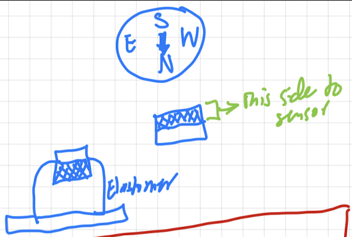

# How to Make an Elastomer for Magnetic BPH Sensor
## Starling Medical
### Ibrahim Al-Akash

# Elastomer Creation Procedure

## Overview
First, model the elastomer with the appropriate geometry for your test. Next, 3D print the elastomer mold. Then, cast the mold using the silicone of the appropriate durometer for your test. Finally, assemble the elastomer with the appropriate magnet for your test.

## Modeling and 3D Printing
1. Design elastomer geometry in SolidWorks. Refer to the file `elastomer_notes.md` or `elastomer_notes.pdf` for further details on how to design an elastomer geometry.
2. Save SolidWorks design as an `.STL` file and import to Chitubox software.
3. In Chitubox software, apply a tilt if possible to the model (for example rotate around z-axis by 45 degrees) and the add supports to model.
4. Ensure the correct resin profile is selected so that the profile matches the resin you will be printing with. Ensure the correct printer is selected in the Chitubox settings.
5. Slice the model and inspect it for any artifacts or errors. If there are errors, try rotating along a different axis and reapplying the supports.
6. Export the slice which will be a `.CTB` file to the directory of your choosing.
7. Upload the exported slice file to a USB flashdrive to send to the 3D printer.
8. Ensure the 3D printer has enough resin to print the parts.
9. Begin the print on the 3D printer.
10. When the 3D print is completed, carefully remove the parts from the plate by using the metal spatula. If the part is stuck, spray a little isopropyl alcohol on it and try again.
11. There should be 3 containers next to the 3D printers labeled `99% Isopropyl Alcohol`, `99% Isopropyl Alcohol (Contaminated)`, and `Diluted Green Wash`. Thoroughly clean the printed parts in each bucket in this order.
12. Set the parts next to the fan and wait ~5 minutes to dry.
13. Place the parts in the water cage in the container at the curing station. Remove the curing plate from the machine and place the water container in its place. Close the lid on it. Make sure the curing machine is set to rotation mode, not light mode. Set the time to 5:00 (6:00 if there are a lot of parts) and let the machine rinse the parts.
14. Once the rinse step is completed, set the parts next to the fan and wait 10 to 15 minutes until they are dry.
15. Once the parts are finished, place the curing plate on the curing machine. Ensure the magnets are aligned correctly so the plate is flush against the base. Ensure the curing machine is set to light mode. Set the time to 5:00 if you are using a VytaFlex or other tin-based silicone. If you are using an ExoFlex or other platinum-based silicone, set the time to as long as possible.
16. Once the curing is completed, carefully remove the supports from the parts using pliers.

## Casting the Silicone Mold
### EcoFlex or Platinum-Based Silicone
1. Spray acryllic lacquer onto the 3D printed molds and ensure any surface that will come into contact with the silicone is sufficiently covered with the lacquer. Wait 24 hours for the acryllic lacquer to cure properly. *This step is critical because platinum-based silicone does not cure well when in contact with the resin. You must disrupt the chemical interaction in order for the silicone to cure properly*.
2. Apply a light coat of MAN200 Releasing Agent to the 3D printed molds.
3. Thoroughly stir Part A and Part B silicones with a popsicle stick prior to dispensing them from their containers. Use separate popsicle sticks for Part A vs. Part B.
4. Ensure you have a scale nearby to measure the Part A and Part B solutions. Place a measuring cup on the scale and tare it. Dispense the appropriate mass of Part A solution into the measuring cup. 
5. Tare the measuring cup with the Part A solution in it. Follow the instructions on the containers to determine the ratio of Part A : Part B by mass. Dispense the appropriate amount of Part B solution into the measuring cup.
6. Thoroghly mix the Part A and Part B mixture using a popsicle stick for 2-3 minutes. The containers for the silicones have a "pot life" specified. This means you can handle the silicones for the specified amount of time before it begins curing.
7. *OPTIONAL*: Place the measuring cup in the vaccum chamber, ensuring the vaccum nozzle is not directly over the cup. Activate the vacuum and wait 3-5 minutes for the bubbles to escape the mixture. *This step is optional, however it produces the best results by removing any bubbles or trapped air from the mixture*.
8. Carefully pour the mixture into the bottom mold until the silicone mixture is flush with the top of the bottom mold. Use a popsicle stick to straighten it out and keep it perfectly flush with the top surface. Then, carefully place the top mold in the approprate position.
9. Wait until the recommended cure time has passed.
10. Carefully open the molds and remove the silicone cast.

### VytaFlex or Tin-Based Silicone
1. Apply a light coat of MAN200 Releasing Agent to the 3D printed molds.
2. Thoroughly stir Part A and Part B silicones with a popsicle stick prior to dispensing them from their containers. Use separate popsicle sticks for Part A vs. Part B.
3. Ensure you have a scale nearby to measure the Part A and Part B solutions. Place a measuring cup on the scale and tare it. Dispense the appropriate mass of Part A solution into the measuring cup. 
4. Tare the measuring cup with the Part A solution in it. Follow the instructions on the containers to determine the ratio of Part A : Part B by mass. Dispense the appropriate amount of Part B solution into the measuring cup.
5. Thoroghly mix the Part A and Part B mixture using a popsicle stick for 2-3 minutes. The containers for the silicones have a "pot life" specified. This means you can handle the silicones for the specified amount of time before it begins curing.
6. *OPTIONAL*: Place the measuring cup in the vaccum chamber, ensuring the vaccum nozzle is not directly over the cup. Activate the vacuum and wait 3-5 minutes for the bubbles to escape the mixture. *This step is optional, however it produces the best results by removing any bubbles or trapped air from the mixture*.
7. Carefully pour the mixture into the bottom mold until the silicone mixture is flush with the top of the bottom mold. Use a popsicle stick to straighten it out and keep it perfectly flush with the top surface. Then, carefully place the top mold in the approprate position.
8. Wait until the recommended cure time has passed.
9. Carefully open the molds and remove the silicone cast.

## Elastomer Assembly
1. Acquire the appropriate magnet for the elastomer and ideally get a magnetic compass to help with properly orienting the magnet prior to adhering it to the elastomer.
2. Ensure the magnet is oriented so that the side of the magnet that attracts the needle North on the compass is facing the sensor as shown in the diagram below:

Alternatively, if you do not have a compass, have the magnetometer sensor running and make sure the magnet is oriented in a way that produces positive B-field values in the magnetometer z-axis data. *This is a very important step. Remember, measure twice and cut once. You must ensure you are certain that the magnet orientation is correct before moving onto the next step*.
3. Apply just enough super glue to adequately cover the surface of the magnet in contact with the elastomer.
4. Wait 10-30 minutes for the super glue to cure.