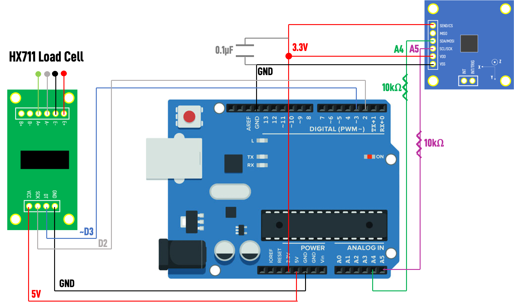

# Testing Protocol
## Starling Medical
### Ibrahim Al-Akash

# Procedure Overview:
To conduct a static water test for the magnetometer BPH sensor, you must first assemble the sensor circuit, set up the Arduino development environment, prepare the data logger, perform the appropriate experiment, clean the data log, and analyze the data.

## Sensor Circuit Assembly
First, assemble the magnetometer and elastomer assembly by following the instructions documented in the file `elastomer_creation_procedure.md` or `elastomer_creation_procedure.pdf`. To conduct the static water test using the MLX90393 magnetometer sensor and the HX711 load cell sensor, ensure that the circuit is wired properly before proceeding using the schematic below.



## Arduino Development Environment
After this, make sure that the library I made is imported to the Arduino IDE. The library is a folder called `Starling_MLX90393`. It is important that you use my library to interact with the magnetometer easily. DO NOT use any prebuilt libraries, they did not work. The prebuilt Adafruit library works, however it is very limited. My library takes advantage of many functions and settings built into the sensor's hardware. Then, open the file titled `starling_mlx90393_demo.ino` and upload the code to the Arduino Uno. 

## Prepping Data Logger
Next, to collect the data from the Arduino and store it on the computer, first open the terminal (on a MacOS computer). Then navigate to the directory of your choice where you want to store the data using the `cd PATHNAME/FILENAME` command in the terminal and make a script file by pasting the code below into the terminal:

`script -a -t0 FILENAME.txt`

Then, when you are ready to begin the test, run the following code in the terminal:

`screen ARDUINO_PORT 115200`

The `ARDUINO_PORT` can be located in the Arduino IDE by navigating to the `TOOLS -> PORT` menu and finding the name associated with (Arduino Uno). For example, mine is `/dev/cu.usbmodem11301`. Do not include the "(Arduino Uno)" in the port name. The number 115200 is the baudrate specified in the Arduino `.INO` file uploaded to the Arduino Uno. If you change the baud rate, this number must be changed in the terminal command. After this command is submitted, the terminal will enter into "recording mode" and the Arduino will begin running the code. The terminal will now become the Serial monitor and everything written on the Serial monitor will be logged to the file specified in the script code above. 

## Performing an Experiment
Follow the onscreen instructions to calibrate the load sensor scale. Ensure you have the 10g lead weight nearby to do the calibration correctly. After calibration, press any key to begin collecting data. The data collected is in this format:

`Sample # || Time || X-Axis B-Field || Y-Axis B-Field || Z-Axis B-Field || Mass`

### Experiment Ideas
- **Ground Test** - Log magnetometer and mass data over the testing period WITHOUT the elastomer and WITHOUT adding any water. There is NO magnet in this experiment. You should expect to see a steady horizontal line in the B-field readings and a steady 0 line in the mass readings. This should remain steady given the environment is not disturbed during the experiment and the load cell is calibrated accurately.
- **Functionality Test** - Log magnetometer and mass data over the testing period while manually pressing down on the elastomer with your hand. You should see the magnetometer and mass data spiking as you press with a harder force.
- **Calibration Test** - Log magnetometer and mass data over the testing period. Start with an empty container of 0g of water and steadily inject increments of water over equal time intervals until 100g to 120g of water is added. Use this data to conduct a polynomial fit between mass and B-field readings.
- **Accuracy Test** - Log magnetometer and mass data over the testing period. Start with an empty container of 0g of water and steadily inject increments of water over equal time intervals until 100g to 120g of water is added. Input the B-field readings into the polynomial from the calibration test and compare to the true mass readings.
- **False Negative Test** - Log magnetometer and mass data over the testing period WITH the elastomer and without adding any water. There IS magnet in this experiment. You should expect to see a steady horizontal line in the B-field readings and a steady 0 line in the mass readings. This should remain steady given the environment is not disturbed during the experiment and the load cell is calibrated accurately.

When you are satisfied with the test, to stop simply press `ctrl+A` followed by `ctrl+K`. You will be asked if you are sure you want to kill the program. Press `Y`. Then, the terminal will exit the Serial monitor screen. Finally, press `ctrl+D` and the script will save the log to the file. NOTE: This data is not in a usable format yet, it needs to be cleaned. 

## Cleaning the Data Log
First, open the `.TXT` file you just created and the delete all the text that comes before the header line (the header line is this text: `Sample  TimeXYZ`). Then, delete all the text right after the last data point line. The text should look something like: 

```
Really kill this window [y/n]
                                                                                                                      
[?1l>
[?1049l[screen is terminating]
%                                                                                                                     
 
]7;file://Andalusia-MacBook-Pro.local/Users/jordanianjoker/Desktop/Starling-Medical/Programs/Magnet%20BPH%20Sensor
(base) jordanianjoker@Andalusia-MacBook-Pro Magnet BPH Sensor % [?2004h[?2004l


Saving session...
...saving history...truncating history files...
...completed.

Script done on Thu Aug 17 17:05:10 2023
```

After these 2 texts are removed, you must then run a Python file I made to clean the extraneous characters called `logger_cleaner.py`. Make sure you replace the directory, pathnames, and filenames with the appropriate names before running the script. This will generate a `.CSV` file of the filename specified in the code containing all the cleaned data. This `.CSV` file should be ready for data analysis. 

### Error Notes
Sometimes the Arduino might skip a `\t` character and it will mess up a line in the csv. You can find the specific line by making a for loop in Python that loops i in range(len(file_data)) and then print(i) followed by print(float(file_data[i][4])). When the erroneous line is encountered, the line number will be printed to the console and you can use a csv file editor to remove that row (I use Numbers on Mac). Keep doing this until all the erroneous rows are removed (it should only be a few rows).